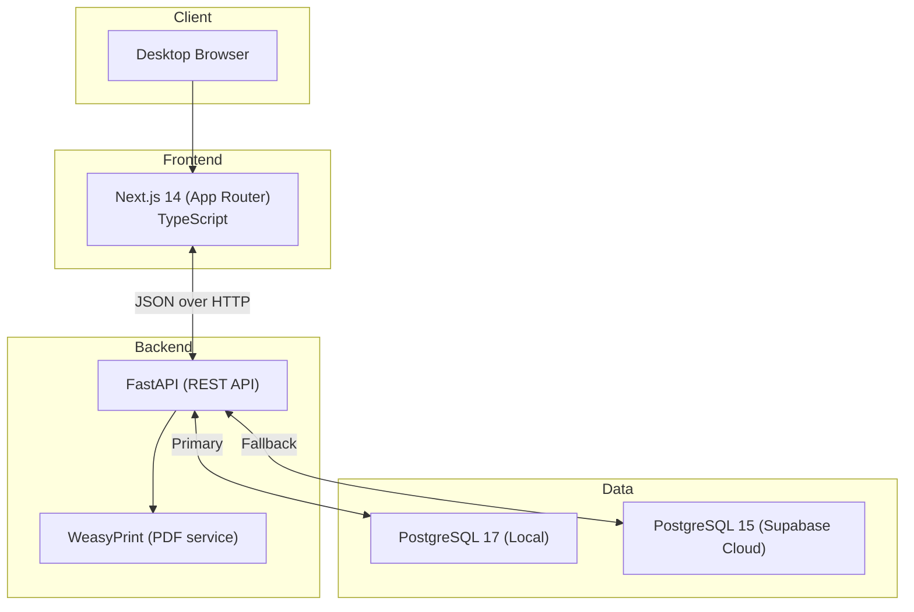

# ConsultaMed Architecture Overview

> Current implemented architecture (source of truth for this repository state).

## System Context

ConsultaMed is an EHR for small private practices in Spain (1-2 physicians), optimized for fast consultation documentation and prescription generation.

## Runtime Architecture



## Database Runtime Selection

- Backend uses a single runtime selector: `DATABASE_URL`.
- Local profile example: `backend/.env.local.example`.
- Supabase profile example: `backend/.env.supabase.example`.
- Operator switch: edit `DATABASE_URL` in `backend/.env`.
- Infrastructure provisioning (Docker + migrations) remains in `./scripts/setup-local-db.sh` and is independent from runtime selector logic.
- Script path: run from repo root (`./scripts/setup-local-db.sh`) or from `backend/` as `../scripts/setup-local-db.sh`.

## Authentication Model (Current)

### Authentication Flow
Authentication is implemented using JWT tokens with bcrypt password hashing:

**1. Login Request**
- Frontend submits `username` (email) and `password` via `OAuth2PasswordRequestForm`.
- Backend queries `Practitioner` by `telecom_email`.
- Backend verifies password using `bcrypt.checkpw()` against stored `password_hash`.

**2. Token Issuance**
- Backend generates JWT token using `jose.jwt.encode()` with HS256 algorithm.
- Token payload: `{"sub": practitioner_id, "exp": utc_timestamp + 8h}`.

**3. Session Start**
- Frontend stores token in `localStorage`.

**4. Authenticated Requests**
- Frontend sends `Authorization: Bearer <token>` header on all API requests.
- Backend dependency `get_current_practitioner()` decodes JWT.
- If valid, request proceeds with `Practitioner` context.

## Core Functional Flows

### 1. Login
1. User submits email/password in frontend.
2. Frontend calls backend `/api/v1/auth/login`.
3. Backend returns JWT + practitioner profile.
4. Frontend stores token and redirects to dashboard.

### 2. Consultation Lifecycle
1. Doctor opens patient record.
2. Frontend requests encounters: `/api/v1/encounters/patient/{patient_id}`.
3. Doctor documents SOAP flow (`reason`, `subjective`, `objective`, `assessment`, `plan`, `recommendations`) and diagnosis/treatment.
4. Backend persists structured encounter text in `Encounter` plus linked `Condition` and `MedicationRequest`.
5. Doctor downloads PDF from `/api/v1/prescriptions/{encounter_id}/pdf`.

## Backend Responsibilities

| Layer | Responsibility |
|------|----------------|
| `app/api/` | REST endpoints and contracts |
| `app/models/` | SQLAlchemy entities (FHIR-aligned naming) |
| `app/schemas/` | Patient-related Pydantic schemas |
| `app/services/` | Business logic (`PatientService`, PDF service) |
| `app/validators/` | DNI/NIE + clinical input validation |

## Frontend Responsibilities

| Layer | Responsibility |
|------|----------------|
| `src/app/` | Route pages (dashboard, patients, encounters, templates) |
| `src/lib/api/client.ts` | API wrapper with `/api/v1` prefix + auth header |
| `src/lib/stores/auth-store.ts` | Lightweight auth state + persistence |
| `src/components/ui/` | Shared UI primitives |
| `src/types/api.ts` | Manual bridge and FE-only API types |
| `src/types/api.generated.ts` | Auto-generated types from OpenAPI schema |

## Architecture Integrity Guardrails

ConsultaMed enforces architecture integrity through explicit guardrails that run both locally and in CI:

1. Local developer gate: `./scripts/test_gate.sh`
2. Backend architecture checks: `backend/tests/unit/test_architecture_dead_code_guards.py`
3. CI backend test execution: `pytest tests/ -v --tb=short`
4. OpenAPI schema hash verification: `./scripts/verify-schema-hash.sh`

These controls prevent drift between declared architecture and implemented behavior. In particular:
- Route-group wrappers in Next.js must have an active UI routing consumer (`page.tsx` or `default.tsx`).
- Domain validators must be either consumed by runtime code or removed.
- Canonical agent/setup docs are monitored with warning-only drift checks during MVP.
- Any new infrastructural abstraction (routing wrapper, validation API, service facade, cross-cutting helper) must ship with:
  - at least one consuming runtime path, and
  - at least one automated test covering that path.

## FHIR R5 Naming Alignment

| Local Model | FHIR Resource |
|-------------|---------------|
| Patient | Patient |
| Practitioner | Practitioner |
| Encounter | Encounter |
| Condition | Condition |
| MedicationRequest | MedicationRequest |
| AllergyIntolerance | AllergyIntolerance |

## Repository Layout (Active)

```
EHR_Guadalix/
├── backend/
│   ├── app/
│   └── tests/
├── frontend/
│   ├── src/
│   └── scripts/
├── supabase/
│   └── migrations/
├── scripts/
│   ├── generate-types.sh
│   ├── verify-schema-hash.sh
│   └── test_gate.sh
├── docs/
│   ├── architecture/
│   ├── plans/
│   ├── playbooks/
│   └── specs/       # New active specs
└── .archive/        # Historical specs/plans/reference material
```

---

*Last updated: 2026-02-12*
