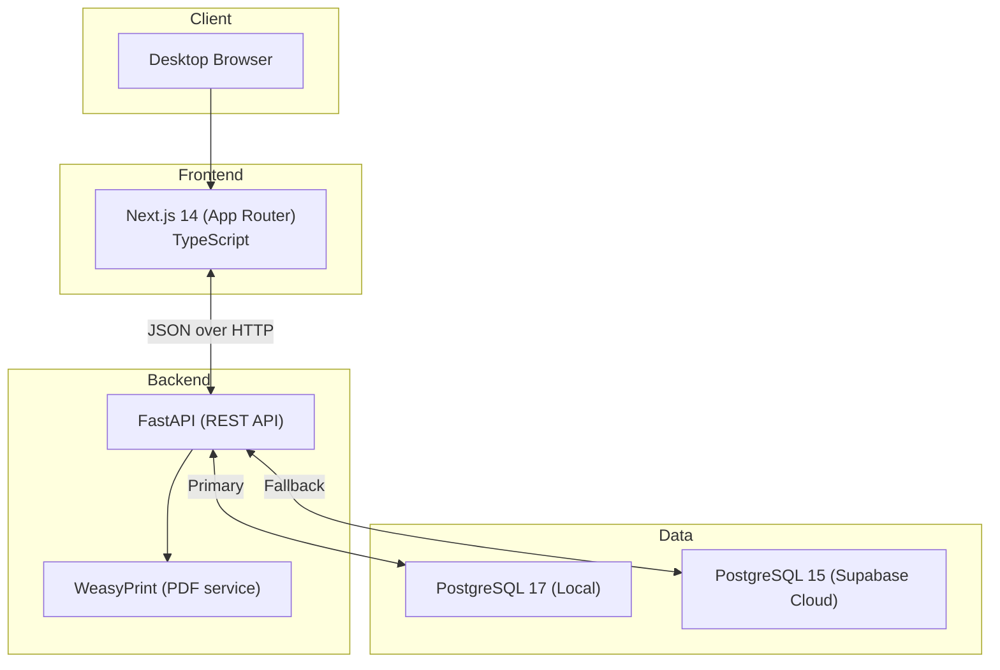

# ConsultaMed Architecture Overview

> Current implemented architecture (source of truth for this repository state).

## System Context

ConsultaMed is an EHR for small private practices in Spain (1-2 physicians), optimized for fast consultation documentation and prescription generation.

## Runtime Architecture



## Database Runtime Selection

- Backend uses a single runtime selector: `DATABASE_URL`.
- Local profile example: `backend/.env.local.example`.
- Supabase profile example: `backend/.env.supabase.example`.
- Operator switch: edit `DATABASE_URL` in `backend/.env`.
- Infrastructure provisioning (Docker + migrations) remains in `./scripts/setup-local-db.sh` and is independent from runtime selector logic.
- Script path: run from repo root (`./scripts/setup-local-db.sh`) or from `backend/` as `../scripts/setup-local-db.sh`.

## Authentication Model (Current)

### Authentication Flow
Authentication is implemented using JWT tokens with bcrypt password hashing:

**1. Login Request**
- Frontend submits `username` (email) and `password` via `OAuth2PasswordRequestForm`.
- Backend queries `Practitioner` by `telecom_email`.
- Backend verifies password using `bcrypt.checkpw()` against stored `password_hash`.

**2. Token Issuance**
- Backend generates JWT token using `jose.jwt.encode()` with HS256 algorithm.
- Token payload: `{"sub": practitioner_id, "exp": utc_timestamp + 8h}`.

**3. Session Start**
- Frontend stores token in `localStorage`.

**4. Authenticated Requests**
- Frontend sends `Authorization: Bearer <token>` header on all API requests.
- Backend dependency `get_current_practitioner()` decodes JWT.
- If valid, request proceeds with `Practitioner` context.

## Core Functional Flows

### 1. Login
1. User submits email/password in frontend.
2. Frontend calls backend `/api/v1/auth/login`.
3. Backend returns JWT + practitioner profile.
4. Frontend stores token and redirects to dashboard.

### 2. Consultation Lifecycle
1. Doctor opens patient record.
2. Frontend requests encounters: `/api/v1/encounters/patient/{patient_id}`.
3. Doctor documents SOAP flow (`reason`, `subjective`, `objective`, `assessment`, `plan`, `recommendations`) and diagnosis/treatment.
4. Backend persists structured encounter text in `Encounter` plus linked `Condition` and `MedicationRequest`.
5. Doctor can edit an existing consultation from `/encounters/{id}/edit`; frontend submits `PUT /api/v1/encounters/{id}` to replace SOAP + linked conditions/medications.
6. Legacy `note` data is preserved during edit when request omits `note` and no new SOAP content is provided.
7. Doctor downloads PDF from `/api/v1/prescriptions/{encounter_id}/pdf`.

## Backend Responsibilities

| Layer | Responsibility |
|------|----------------|
| `app/api/` | REST endpoints and contracts |
| `app/api/exceptions.py` | Centralized HTTPException helpers (`raise_not_found`, `raise_unauthorized`, etc.) |
| `app/models/` | SQLAlchemy entities (FHIR-aligned naming) |
| `app/schemas/` | Atomic FHIR-aligned Pydantic schemas (Condition, Medication, Encounter) |
| `app/services/` | Business logic extending `BaseService` with FHIR naming (`read`, `search`, `create`, `update`, `delete`) |
| `app/services/base.py` | Base service class with FHIR R5 interaction naming conventions |
| `app/validators/` | DNI/NIE + clinical input validation |

## Frontend Responsibilities

| Layer | Responsibility |
|------|----------------|
| `src/app/` | Route pages (dashboard, patients, encounters, templates) |
| `src/lib/api/client.ts` | API wrapper with `/api/v1` prefix, auth header, and centralized error handling |
| `src/lib/stores/auth-store.ts` | Lightweight auth state + persistence |
| `src/lib/hooks/` | Reusable React hooks (`useAuthGuard`, `usePagination`) |
| `src/lib/hooks/useAuthGuard.ts` | Auth guard with loading state (prevents flash of unprotected content) |
| `src/lib/hooks/usePagination.ts` | Abstract pagination hook (FHIR Bundle Links ready, hides limit/offset from UI) |
| `src/lib/hooks/use-encounter-form.ts` | Shared encounter form state/submit logic for create (POST) and edit (PUT) flows |
| `src/components/ui/` | Shared UI primitives |
| `src/types/api.ts` | Manual bridge and FE-only API types |
| `src/types/api.generated.ts` | Auto-generated types from OpenAPI schema |

## Architecture Integrity Guardrails

ConsultaMed enforces architecture integrity through explicit guardrails that run both locally and in CI:

1. Local developer gate: `./scripts/test_gate.sh`
2. Backend architecture checks: `backend/tests/unit/test_architecture_dead_code_guards.py`
3. CI backend test execution: `pytest tests/ -v --tb=short`
4. OpenAPI schema hash verification: `./scripts/verify-schema-hash.sh`

These controls prevent drift between declared architecture and implemented behavior. In particular:
- Route-group wrappers in Next.js must have an active UI routing consumer (`page.tsx` or `default.tsx`).
- Domain validators must be either consumed by runtime code or removed.
- Canonical agent/setup docs are monitored with warning-only drift checks during MVP.
- Any new infrastructural abstraction (routing wrapper, validation API, service facade, cross-cutting helper) must ship with:
  - at least one consuming runtime path, and
  - at least one automated test covering that path.

## FHIR R5 Naming Alignment

| Local Model | FHIR Resource |
|-------------|---------------|
| Patient | Patient |
| Practitioner | Practitioner |
| Encounter | Encounter |
| Condition | Condition |
| MedicationRequest | MedicationRequest |
| AllergyIntolerance | AllergyIntolerance |

## FHIR Architecture Patterns

### Atomic Schemas (FHIR Resources)

Schemas are structured following FHIR R5 resource independence:

- **Atomic resources**: `Condition` and `Medication` schemas are independent of `Encounter`
- **Unidirectional imports**: `Encounter` imports atomic schemas (prevents circular dependencies)
- **Reusability**: Atomic schemas can be used in multiple contexts (e.g., direct CRUD, nested in Encounter)

```
app/schemas/
├── condition.py       # ConditionCreate, ConditionResponse (atomic)
├── medication.py      # MedicationCreate, MedicationResponse (atomic)
└── encounter.py       # EncounterCreate/Update/Response (imports atomic schemas)
```

### Service Layer (FHIR Interactions)

Services follow FHIR R5 interaction naming conventions (avoiding "magic methods"):

- **`read`**: FHIR Read operation (get by ID)
- **`search`**: FHIR Search operation (query with parameters)
- **`create`**: FHIR Create operation
- **`update`**: FHIR Update operation (full replacement)
- **`patch`**: FHIR Patch operation (partial update)
- **`delete`**: FHIR Delete operation

All services extend `BaseService[T]` with:
- Generic typing for primary resource (e.g., `PatientService(BaseService[Patient])`)
- Shared `commit_and_refresh(instance: M)` helper (accepts any model type)
- FHIR-aligned method names (no `save_or_update`, `upsert`, etc.)

### Error Handling

Backend uses centralized exception helpers:

```python
from app.api.exceptions import raise_not_found, raise_bad_request, raise_unauthorized, raise_forbidden

# Instead of:
raise HTTPException(status_code=404, detail="Paciente no encontrado")

# Use:
raise_not_found("Paciente")
```

Frontend uses centralized error response handler in `ApiClient`:

```typescript
private async handleErrorResponse(response: Response): Promise<never> {
  const error = await response.json().catch(() => ({ detail: 'Error desconocido' }));
  throw new Error(error.detail);
}
```

### Pagination Abstraction (FHIR Bundle Links Ready)

Frontend pagination hook (`usePagination`) abstracts limit/offset implementation:

- **UI API**: `nextPage()`, `prevPage()`, `hasNext`, `hasPrev`, `currentPage`, `totalPages`
- **Internal API**: `__internalOffset`, `__internalPageSize` (hidden from UI)
- **Future-proof**: Ready to migrate to FHIR Bundle Links (cursor-based) without UI changes

## Repository Layout (Active)

```
EHR_Guadalix/
├── backend/
│   ├── app/
│   │   ├── api/              # REST endpoints
│   │   │   └── exceptions.py # Centralized HTTPException helpers
│   │   ├── models/           # SQLAlchemy ORM (FHIR-aligned)
│   │   ├── schemas/          # Atomic FHIR Pydantic schemas
│   │   │   ├── condition.py
│   │   │   ├── medication.py
│   │   │   └── encounter.py
│   │   ├── services/         # Business logic (FHIR interactions)
│   │   │   └── base.py       # BaseService with FHIR naming
│   │   └── validators/       # DNI/NIE + clinical validation
│   └── tests/
├── frontend/
│   ├── src/
│   │   ├── app/              # Next.js 14 App Router pages
│   │   ├── lib/
│   │   │   ├── api/
│   │   │   │   └── client.ts # API wrapper with centralized errors
│   │   │   ├── hooks/        # Reusable React hooks
│   │   │   │   ├── useAuthGuard.ts
│   │   │   │   └── usePagination.ts
│   │   │   └── stores/       # Auth store
│   │   ├── components/ui/    # UI primitives
│   │   └── types/            # TypeScript types
│   └── scripts/
├── supabase/
│   └── migrations/
├── scripts/
│   ├── generate-types.sh
│   ├── verify-schema-hash.sh
│   └── test_gate.sh
├── docs/
│   ├── architecture/
│   ├── plans/
│   ├── playbooks/
│   └── specs/                # Active specs
└── (local-only archive, not versioned in git)
```

---

*Last updated: 2026-02-15*
