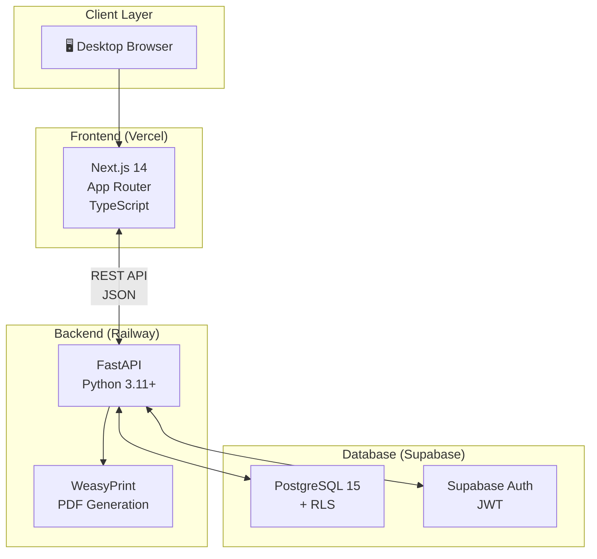
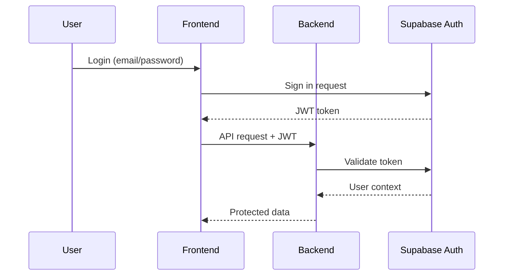
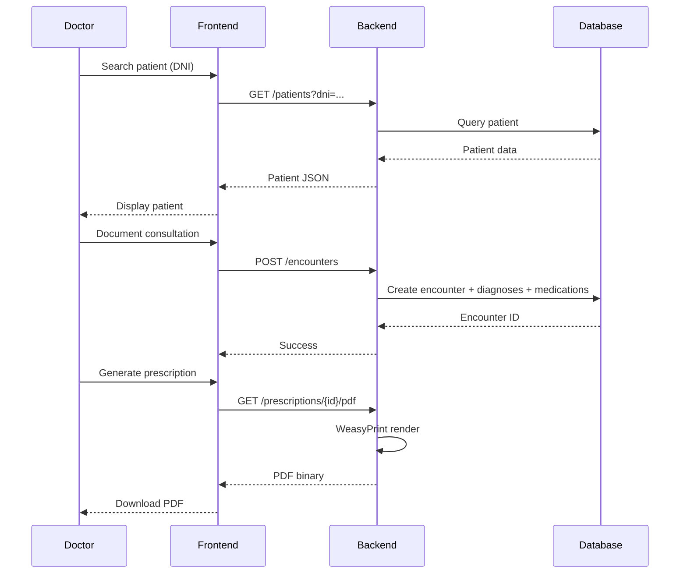
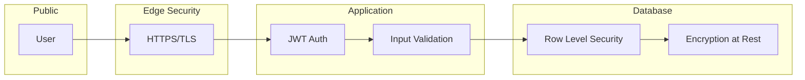

# ConsultaMed Architecture Overview

> Technical architecture document describing the current state of the system.

## System Context

ConsultaMed is an Electronic Health Record (EHR) system designed for small private medical practices in Spain (1-2 physicians). The goal is to document a patient consultation in under 60 seconds.

## Architecture Diagram



## Component Responsibilities

### Frontend (Next.js 14)
| Component | Responsibility |
|-----------|----------------|
| App Router Pages | Page routing and server components |
| TanStack Query | Server state management, caching |
| Zustand | Client state management |
| React Hook Form + Zod | Form handling and validation |
| shadcn/ui + Tailwind | UI components and styling |

### Backend (FastAPI)
| Component | Responsibility |
|-----------|----------------|
| `app/api/` | REST endpoints |
| `app/models/` | SQLAlchemy models (FHIR-aligned) |
| `app/schemas/` | Pydantic request/response schemas |
| `app/services/` | Business logic layer |
| `app/validators/` | DNI/NIE validation, clinical rules |
| `app/templates/` | HTML templates for PDF generation |
| WeasyPrint | Prescription PDF rendering |

### Database (PostgreSQL/Supabase)
| Component | Responsibility |
|-----------|----------------|
| Tables | Patient, Encounter, Condition, etc. |
| RLS Policies | Row-level access control |
| Supabase Auth | JWT-based authentication |

## Data Flow

### Authentication Flow


### Consultation Flow


## FHIR R5 Alignment

Data models are designed to align with FHIR R5 resources for future interoperability:

| Local Entity | FHIR Resource | Notes |
|--------------|---------------|-------|
| `patients` | [Patient](https://hl7.org/fhir/r5/patient.html) | Core demographics |
| `practitioners` | [Practitioner](https://hl7.org/fhir/r5/practitioner.html) | Physician data |
| `encounters` | [Encounter](https://hl7.org/fhir/r5/encounter.html) | Consultation events |
| `conditions` | [Condition](https://hl7.org/fhir/r5/condition.html) | Diagnoses (ICD-10) |
| `medication_requests` | [MedicationRequest](https://hl7.org/fhir/r5/medicationrequest.html) | Prescriptions |
| `allergies` | [AllergyIntolerance](https://hl7.org/fhir/r5/allergyintolerance.html) | Patient allergies |

## Current State vs Target

| Aspect | Current (MVP) | Target (Production) |
|--------|---------------|---------------------|
| Auth | Supabase Auth, 8h JWT | 1h JWT, refresh tokens |
| Hosting | localhost | Vercel + Railway + Supabase |
| RLS | Partial | Full coverage |
| Audit | Limited | Complete audit trail |
| FHIR | Naming only | Full resource mapping |

## Security Architecture



## File Structure

```
consultamed/
├── AGENTS.md              # Agent contract (canonical)
├── CLAUDE.md              # Claude shim
├── README.md              # Project overview
├── backend/               # FastAPI application
│   ├── app/
│   │   ├── api/          # REST endpoints
│   │   ├── models/       # SQLAlchemy models
│   │   ├── schemas/      # Pydantic schemas
│   │   ├── services/     # Business logic
│   │   ├── validators/   # DNI, NIE, clinical
│   │   └── templates/    # PDF templates
│   ├── tests/            # Pytest tests
│   └── pyproject.toml    # Python tooling config
├── frontend/              # Next.js application
│   ├── src/
│   │   ├── app/          # App Router pages
│   │   ├── components/   # React components
│   │   ├── lib/          # Utilities
│   │   └── types/        # TypeScript types
│   └── tests/            # Frontend tests
├── database/              # SQL schema
├── docs/                  # Documentation
│   └── architecture/     # This directory
├── specs/                 # Feature specifications
│   └── 001-consultamed-mvp/
└── .github/               # CI/CD and agent config
    ├── workflows/
    └── copilot-instructions.md
```

---

*Last updated: 2026-02-07*
