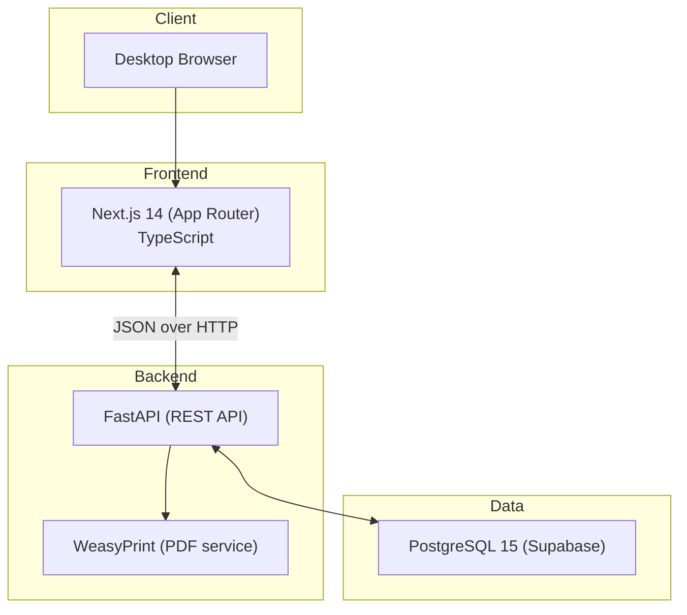

# ConsultaMed Architecture Overview

> Current implemented architecture (source of truth for this repository state).

## System Context

ConsultaMed is an EHR for small private practices in Spain (1-2 physicians), optimized for fast consultation documentation and prescription generation.

## Runtime Architecture



## Authentication Model (Current)

- Login is handled by `POST /api/v1/auth/login` in FastAPI.
- Backend validates practitioner credentials with bcrypt hash.
- Backend issues JWT (HS256) and validates it on protected endpoints.
- Frontend stores token in `localStorage` and sends `Authorization: Bearer <token>`.

## Core Functional Flows

### 1. Login
1. User submits email/password in frontend.
2. Frontend calls backend `/api/v1/auth/login`.
3. Backend returns JWT + practitioner profile.
4. Frontend stores token and redirects to dashboard.

### 2. Consultation Lifecycle
1. Doctor opens patient record.
2. Frontend requests encounters: `/api/v1/encounters/patient/{patient_id}`.
3. Doctor documents SOAP flow (`reason`, `subjective`, `objective`, `assessment`, `plan`, `recommendations`) and diagnosis/treatment.
4. Backend persists structured encounter text in `Encounter` plus linked `Condition` and `MedicationRequest`.
5. Doctor downloads PDF from `/api/v1/prescriptions/{encounter_id}/pdf`.

## Backend Responsibilities

| Layer | Responsibility |
|------|----------------|
| `app/api/` | REST endpoints and contracts |
| `app/models/` | SQLAlchemy entities (FHIR-aligned naming) |
| `app/schemas/` | Patient-related Pydantic schemas |
| `app/services/` | Business logic (`PatientService`, PDF service) |
| `app/validators/` | DNI/NIE + clinical input validation |

## Frontend Responsibilities

| Layer | Responsibility |
|------|----------------|
| `src/app/` | Route pages (dashboard, patients, encounters, templates) |
| `src/lib/api/client.ts` | API wrapper with `/api/v1` prefix + auth header |
| `src/lib/stores/auth-store.ts` | Lightweight auth state + persistence |
| `src/components/ui/` | Shared UI primitives |

## FHIR R5 Naming Alignment

| Local Model | FHIR Resource |
|-------------|---------------|
| Patient | Patient |
| Practitioner | Practitioner |
| Encounter | Encounter |
| Condition | Condition |
| MedicationRequest | MedicationRequest |
| AllergyIntolerance | AllergyIntolerance |

## Repository Layout (Active)

```
EHR_Guadalix/
├── backend/
│   ├── app/
│   └── tests/
├── frontend/
│   ├── src/
│   └── scripts/
├── supabase/
│   └── migrations/
├── scripts/
├── docs/
└── .archive/   # Historical specs/plans/reference material
```

---

*Last updated: 2026-02-08*
