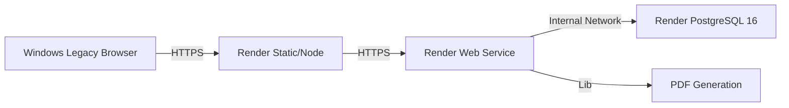

# 🚀 Plan Técnico de Despliegue: Migración a Cloud (Render)

> **Fecha:** 12 Febrero 2026
> **Objetivo:** Desplegar infraestructura MVP en Render para acceso remoto desde cliente Windows legacy.
> **Estado:** Pendiente de Ejecución

## 1. Contexto y Justificación

Actualmente, el proyecto **ConsultaMed (EHR_Guadalix)** funciona 100% en local sobre macOS usando Docker. La necesidad actual exige habilitar el acceso desde un terminal cliente Windows legacy (2014) sin capacidad de virtualización ni Docker, y con restricciones administrativas estrictas.

Para solventar esto, migraremos la infraestructura a la nube utilizando **Render** (por su simplicidad y capa gratuita) manteniendo la arquitectura actual.

### Arquitectura de Destino (Cloud)



## 2. Inventario de Activos

| Componente | Ruta Local | Tecnología | Requisito Crítico |
|------------|------------|------------|-------------------|
| **Backend** | `/backend` | FastAPI / Python 3.11 | `libweasyprint` (GTK3 deps) |
| **Frontend** | `/frontend` | Next.js 14 / Node 20 | Variables de entorno build-time |
| **Database** | `N/A` | PostgreSQL 16 | Migración de schemas SQL existentes |
| **Repo** | GitHub | Git | `render_build.sh` custom |

## 3. Hoja de Ruta de Ejecución (Paso a Paso)

Este plan está diseñado para ser ejecutado secuencialmente por un agente o desarrollador.

### Fase 1: Preparación del Código (Local)

El backend requiere dependencias del sistema operativo (Linux/Debian) para generar PDFs que no se instalan vía `pip`.

1.  **Crear Script de Build Custom:**
    *   **Archivo:** `backend/render_build.sh`
    *   **Propósito:** Instalar librerías gráficas (Pango, Cairo) antes que las dependencias de Python.
    *   **Contenido:**
        ```bash
        #!/usr/bin/env bash
        set -o errexit
        
        echo "🔧 Install system dependencies for WeasyPrint..."
        apt-get update && apt-get install -y libpango-1.0-0 libpangoft2-1.0-0 libharfbuzz-subset0 libjpeg-dev libopenjp2-7-dev xcb
        
        echo "🐍 Install Python dependencies..."
        pip install --upgrade pip
        pip install -r requirements.txt
        ```

2.  **Verificar Dependencias Python:**
    *   Asegurar presencia de `gunicorn` y `uvicorn` en `backend/requirements.txt`.

3.  **Push a Repositorio:**
    *   Commit y push de estos cambios a `main`.

---

### Fase 2: Infraestructura de Datos (Render PostgreSQL)

1.  **Provisionar Instancia:**
    *   **Servicio:** Render PostgreSQL.
    *   **Nombre:** `consultamed-db`.
    *   **Región:** Frankfurt (EU Central).
    *   **Versión:** 16.
    *   **Plan:** Free.

2.  **Extracción de Credenciales:**
    *   Obtener `Internal Database URL` (para conexión Backend -> DB).
    *   Obtener `External Database URL` (para migración inicial).

3.  **Migración de Esquema (Seed):**
    *   Ejecutar scripts SQL en orden secuencial contra la `External Database URL`.
    *   **Fuente:** Carpeta `supabase/migrations/`.
    *   **Orden:**
        1. `20260205_initial_schema.sql`
        2. `20260206_add_practitioners.sql`
        3. `20260208_add_password_hash.sql`
        4. `20260208_add_encounter_soap_fields.sql`
        5. `20260209_add_templates.sql`

---

### Fase 3: Despliegue Backend (API)

1.  **Configuración del Servicio:**
    *   **Tipo:** Web Service.
    *   **Repo:** EHR_Guadalix.
    *   **Root Directory:** `backend`.
    *   **Runtime:** Python 3.
    *   **Build Command:** `./render_build.sh` (Crucial para WeasyPrint).
    *   **Start Command:** `uvicorn app.main:app --host 0.0.0.0 --port $PORT`.

2.  **Variables de Entorno (Environment Variables):**
    
    | Variable | Valor / Notas |
    |----------|---------------|
    | `PYTHON_VERSION` | `3.11.9` |
    | `DATABASE_URL` | *Internal DB URL de Fase 2* |
    | `DATABASE_MODE` | `supabase_cloud` (Fuerza uso de driver cloud) |
    | `JWT_SECRET_KEY` | *Generar UUID v4 seguro* |
    | `JWT_ALGORITHM` | `HS256` |
    | `ACCESS_TOKEN_EXPIRE_MINUTES` | `480` |
    | `ENVIRONMENT` | `production` |
    | `FRONTEND_URL` | *URL que se generará en Fase 4 (placeholder temporal)* |

3.  **Verificación:**
    *   Deploy exitoso.
    *   Endpoints `/docs` accesibles.
    *   Endpoint `/health` retorna 200 OK.

---

### Fase 4: Despliegue Frontend (Cliente)

1.  **Configuración del Servicio:**
    *   **Tipo:** Web Service.
    *   **Repo:** EHR_Guadalix.
    *   **Root Directory:** `frontend`.
    *   **Runtime:** Node.
    *   **Build Command:** `npm install && npm run build`.
    *   **Start Command:** `npm start`.

2.  **Variables de Entorno:**
    
    | Variable | Valor |
    |----------|-------|
    | `NODE_VERSION` | `20` |
    | `NEXT_PUBLIC_API_URL` | *URL HTTPS del Backend (Fase 3)* |

3.  **Post-Deployment:**
    *   Actualizar variable `FRONTEND_URL` en el servicio Backend con la URL final del Frontend para corregir CORS.

---

### Fase 5: Validación Final (Smoke Test)

1.  Acceder a URL Frontend desde navegador externo.
2.  Login con credenciales piloto (`sara@consultamed.es`).
3.  Flujo crítico:
    *   [ ] Listar pacientes.
    *   [ ] Crear consulta.
    *   [ ] **Generar PDF** (Prueba crítica de WeasyPrint).

## 4. Notas Técnicas y Limitaciones

*   **Cold Starts:** Al usar el Free Tier, los servicios se "duermen" tras 15 minutos de inactividad. El primer login puede tardar ~50 segundos. Esto es comportamiento esperado, no un error.
*   **Persistencia:** La base de datos Postgres Free de Render tiene una retención de 90 días (requiere renovación manual) y 1GB de límite.
*   **Archivos:** El sistema de archivos en Render es efímero. Los PDFs generados se envían al navegador pero no se guardan permanentemente en el disco del servidor (lo cual es correcto para seguridad).

---
**Autor:** Arquitectura Técnica EHR_Guadalix
